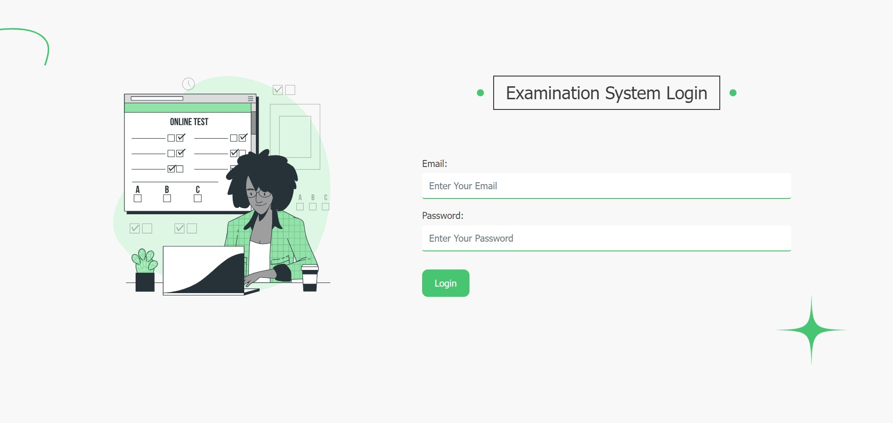

<h1 >Examination System</h1>

    

        The Examination System is a web application designed to streamline the management of courses, instructors, and students within an educational institution. It offers different levels of access and functionality for administrators, instructors, and students. This project is built using ASP.NET Core MVC framework with a SQL database backend, and it is hosted on Microsoft Azure for scalability and reliability.
    

     
    

        
    

 
 

## Features

- **User Roles**: Administrators, Instructors, and Students have distinct roles with specific functionalities.
- **CRUD Operations**: Administrators can perform CRUD operations on courses, instructors, and students.
- **Exam Generation**: Instructors can generate exams, add questions (multiple-choice, true/false), and grade student assessments.
- **Student Dashboard**: Students can view enrolled courses, access course materials, and take exams within specified time frames.
- **Reporting**: Administrators can generate reports on course enrollment, exam results, and other metrics.
- **Password Management**: Users can change their passwords securely for account security.

## UI First Page

## Team Members

- Asmaa Albhbity (@AsmaaAlbhbity) 
- Asmaa Elfatayry (@asmaa-elfatayry) 
- Aya Shehata (@AyaSHEHAT) 
- Nada Atef (@nadaatef15) 
- Nada Mohsen (@nadamohsen15) 

## Technology Stack

- **Backend**: ASP.NET Core MVC
- **Database**: SQL Server
- **Frontend**: HTML, CSS, JavaScript, Bootstrap
- **Hosting**: Microsoft Azure

## Contributing

Contributions to the Examination System project are welcome! If you find any bugs, have feature requests, or want to contribute code, please follow these steps:

1. Fork the repository on GitHub.
2. Create a new branch with a descriptive name (`git checkout -b feature/new-feature`).
3. Make your changes and commit them with clear messages (`git commit -m "Add new feature"`).
4. Push your changes to your forked repository (`git push origin feature/new-feature`).
5. Create a pull request on the original repository.

